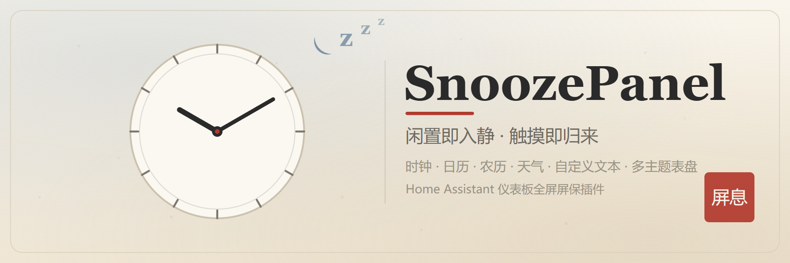
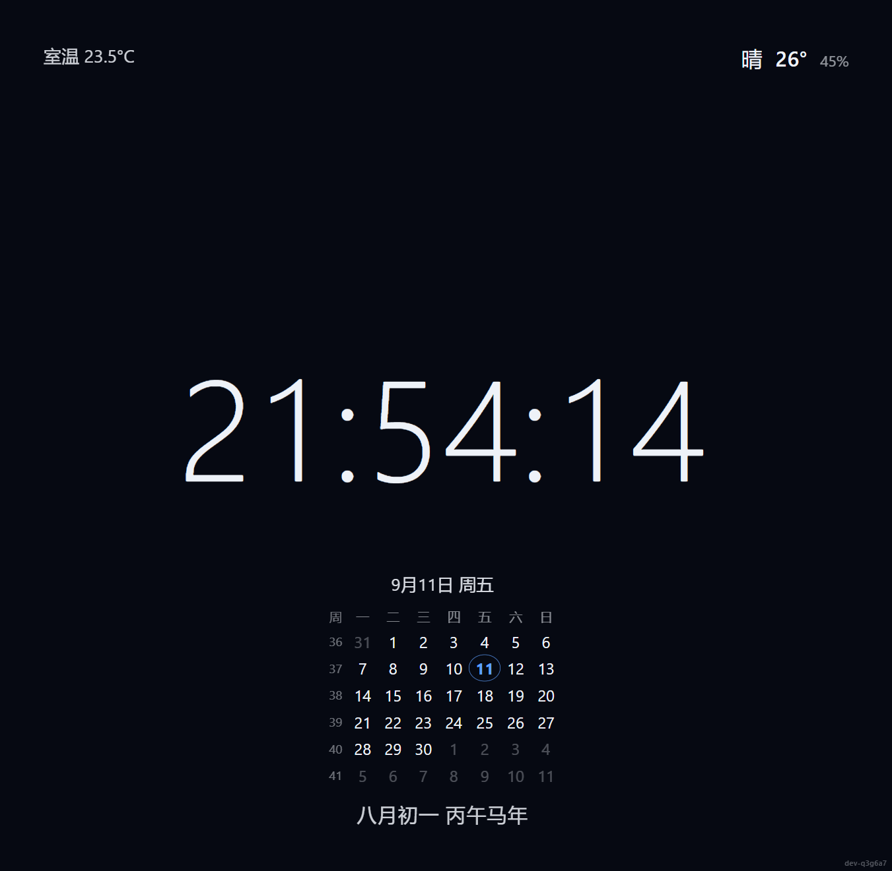
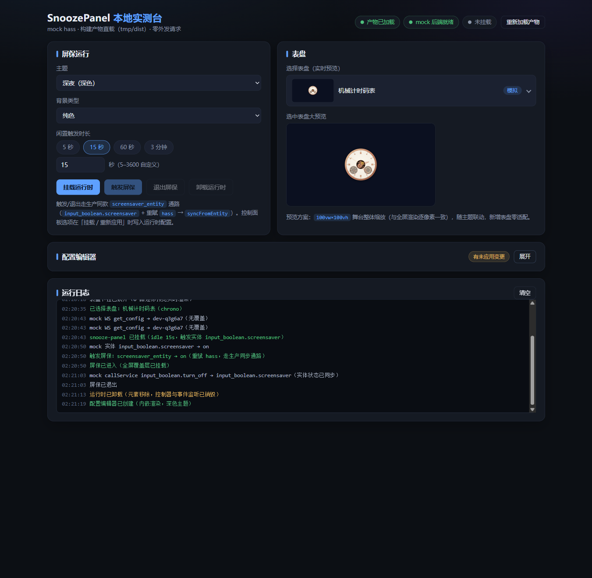
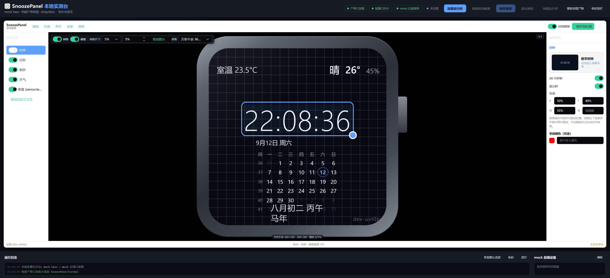
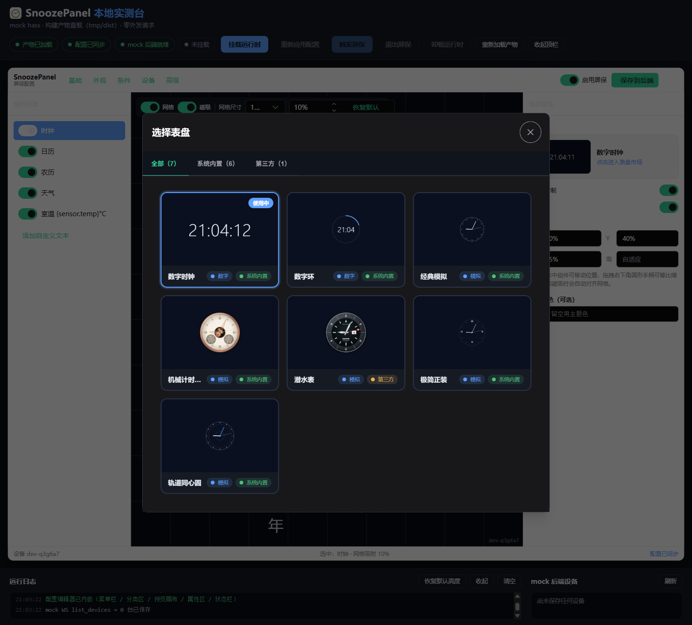
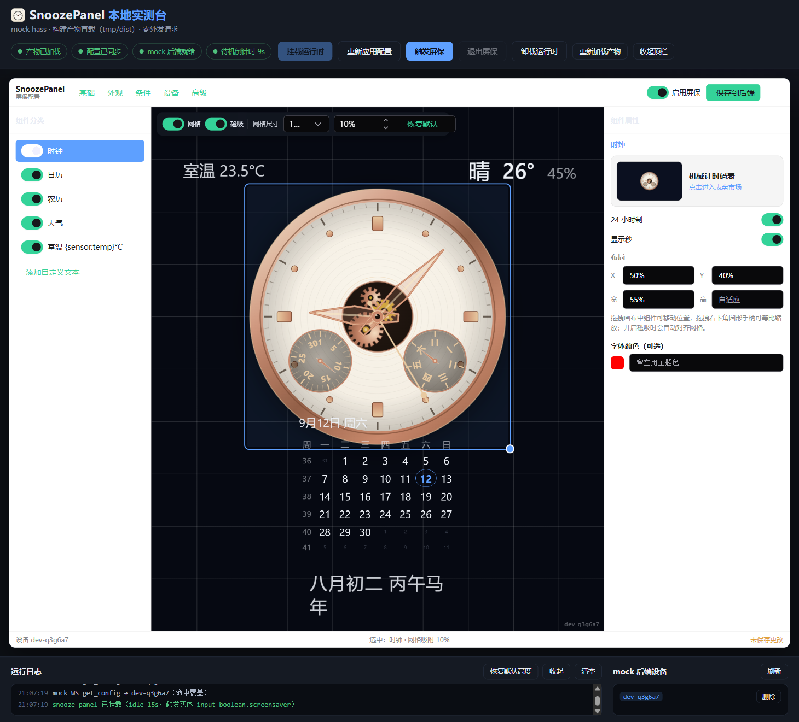
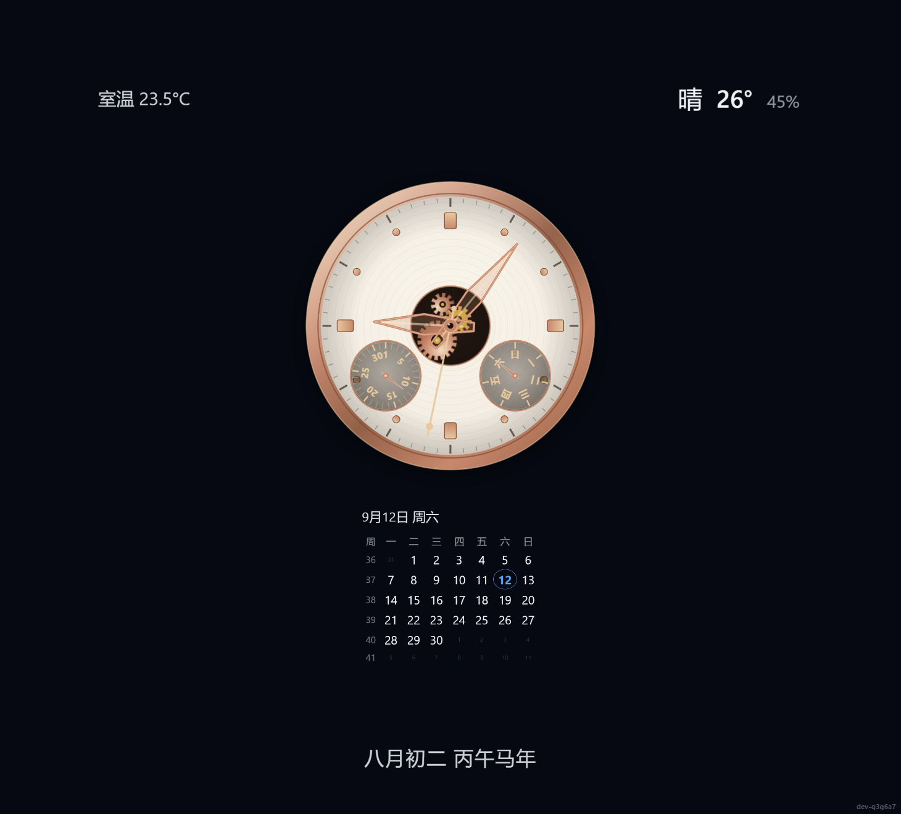
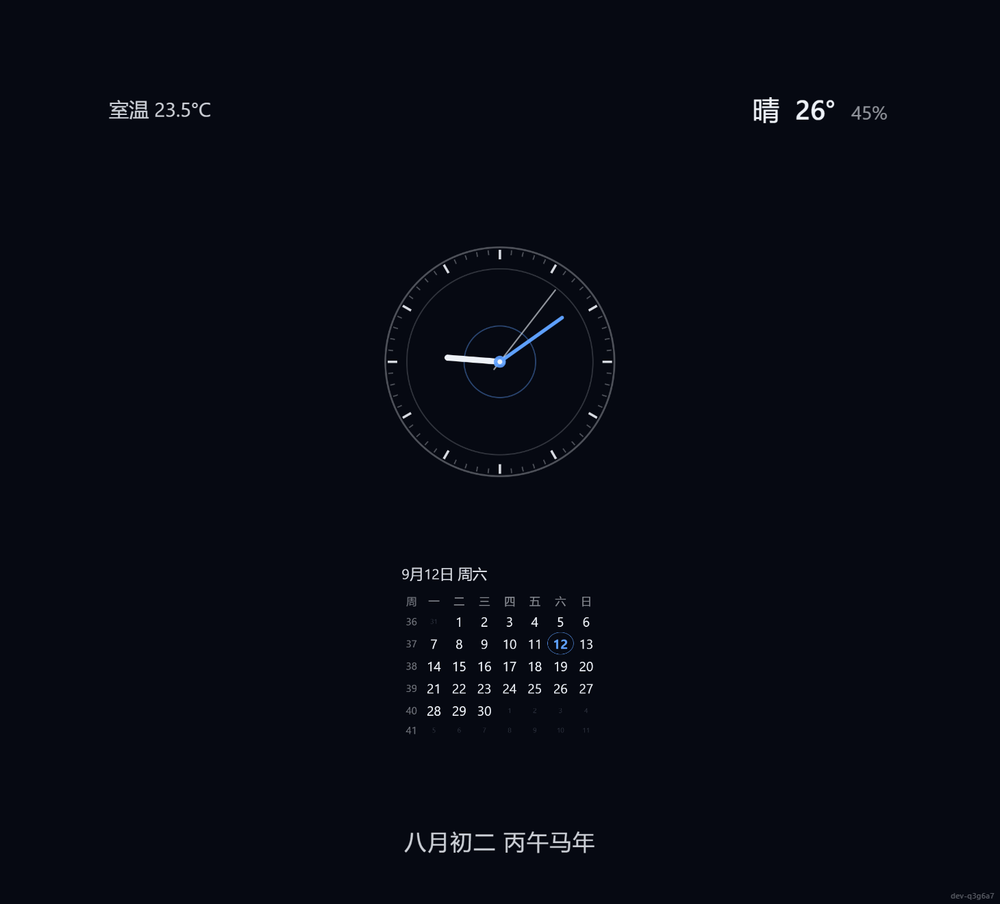
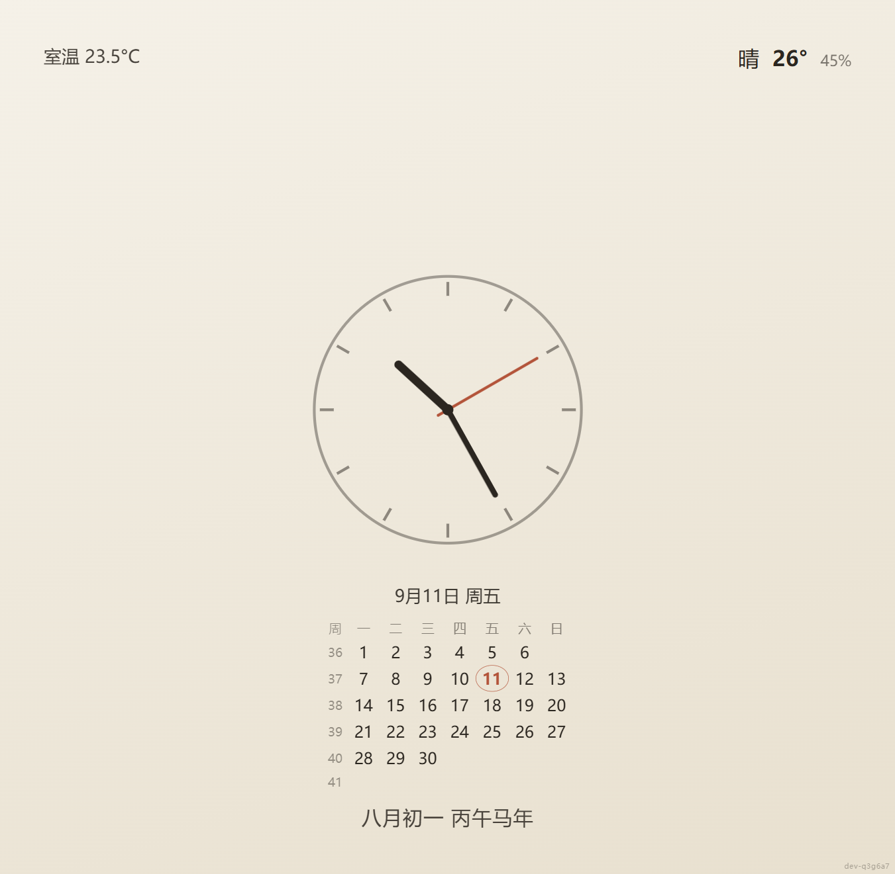
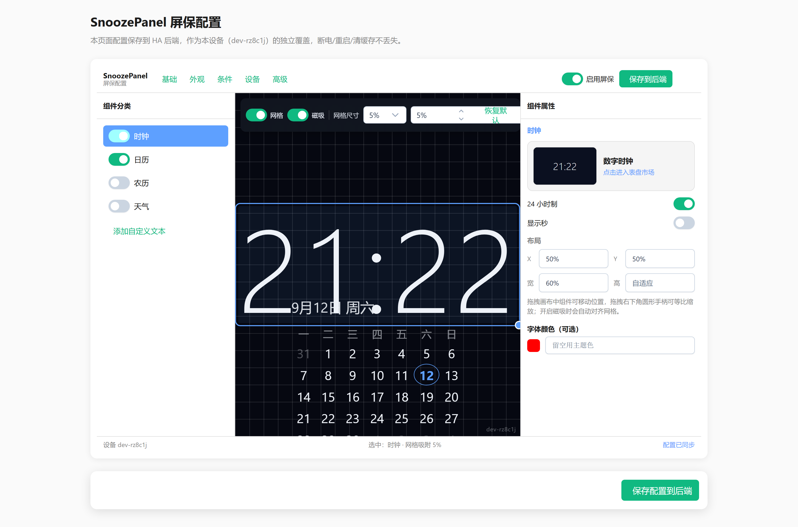

# SnoozePanel

> Home Assistant 仪表板屏保插件 —— 平板中控闲置后自动切换全屏屏保，触摸即返回原仪表板，不刷新页面。



## 这是什么

把闲置的 HA 平板中控变成一块「会呼吸的屏」：无人操作时自动进入全屏屏保，显示时钟、日历、农历、天气、自定义文本，背景支持纯色/渐变/图片轮播；轻触屏幕或按任意键立即回到原仪表板，无页面刷新、无加载白屏。

**按需注入，零副作用**：只有视图 raw YAML 里写了 `snoozepanel:` 段的视图才会加载屏保逻辑，其余视图完全无感。

## 特性

- **范围控制**
  - 视图级：仅配置了 `snoozepanel:` 段的视图生效
  - 设备级：`?snooze_device=xxx` URL 参数 + 白名单/黑名单，多平板差异化控制
- **生效条件**（全部满足才触发，AND 组合）
  - 闲置时长（秒）
  - 实体状态（state / above / below）
  - 时间段（after / before / weekday，支持跨午夜）
  - 日出日落偏移（分钟）
  - 条件失效时即使屏保中也立即退出
- **可定制组件**
  - 时钟：数字 / 模拟表盘，12/24 小时制，秒显开关
  - 日历：周起始日、周数、自定义格式
  - 农历：自包含 1900–2100 数据表，支持干支/生肖
  - 天气：对接 `weather.*` 实体
  - 自定义文本：支持 `{entity_id}` 实体占位符
  - 背景：纯色 / 渐变 / 图片轮播 + 暗化遮罩
  - 布局：九宫格位置或绝对坐标
  - 主题：深夜（深色）/ 宣纸（浅色）
  - `display_template`：JS 表达式按实体动态显隐组件，异常自动降级
- **配置界面**：PrimeVue 中文 GUI 编辑器，覆盖全部配置项
- **交互**
  - 触摸 / 点击 / 按键退出，含退出冷却防误触
  - `screensaver_entity` 双向同步（可联动 HA 自动化）
  - 后台标签页自动暂停计时，省资源
- **健壮性**：退出时彻底卸载 Vue 子应用、清空全部定时器与监听器，无内存泄漏；不收集任何数据

## 截图

### 本地实测台（克隆后可离线体验）

| 实测台首屏 | 中文配置编辑器 | 表盘市场 |
|---|---|---|
|  |  |  |

一键完成 挂载 → 触发 → 退出 → 卸载，全程有状态徽标与分级运行日志：



### 屏保表盘 × 主题

| 数字时钟 · 深夜 | 机械计时码表 · 深夜 | 轨道同心圆 · 深夜 | 经典模拟表盘 · 宣纸 |
|---|---|---|---|
|  |  |  |  |

### HA 侧中文配置编辑器



## 安装

### HACS 自定义仓库（推荐）

1. HACS → 右上角菜单 → Custom repositories → 添加本仓库地址，类型选 `Dashboard`
2. 安装 SnoozePanel
3. HA 会自动注册前端资源（若未自动注册，见下方手动方式）

> **侧边栏图标**：本项目注册了品牌自定义图标集（单色），HA 侧边栏以 `snoozepanel:logo` 显示。若目标环境未加载该图标集，可在 [`custom_components/snoozepanel/__init__.py`](custom_components/snoozepanel/__init__.py) 把 `sidebar_icon` 改回任意 `mdi:` 图标。彩色品牌标见 [`img/logo.svg`](img/logo.svg)。

### 手动资源

1. 下载 [snoozepanel.js](tmp/dist/snoozepanel.js) 放到 HA 的 `www/` 目录（如 `/config/www/snoozepanel.js`）
2. 设置 → 仪表板 → 右上角 ⋮ → 资源 → 添加资源：
   - URL：`/local/snoozepanel.js`
   - 类型：JavaScript 模块

## 快速上手（5 分钟）

在目标视图的 raw YAML 顶部加一段：

```yaml
snoozepanel:
  enabled: true
  idle_seconds: 60
  components:
    clock: { show: true, style: digital, position: center }
    weather: { show: true, entity: weather.forecast_home, position: top_right }
views:
  - title: 客厅
    cards:
      - type: custom:snooze-panel   # 不可见锚点卡片，必须放在视图末尾
      - type: ...
```

> **注意**：`type: custom:snooze-panel` 卡片是视图级注入的锚点，自身不渲染任何内容，但必须存在且建议放在视图 cards 列表末尾。

保存后该视图闲置 60 秒即进入屏保。完整教程见 [doc/使用教程/01-快速上手.md](doc/使用教程/01-快速上手.md)。

## 开发与测试

本仓库自带 mock 实测页（`dev/index.html` + `dev/dev.js` 入口及其同目录 ES 模块：`types / constants / state / log / mock / bundle / config / editor / runtime / layout.js`），clone 后**无需连接真实 HA** 即可核对/验证全部功能：

```bash
pnpm install
pnpm build
python -m http.server 8765        # 或任意静态服务器
# 浏览器打开 http://127.0.0.1:8765/dev/
```


mock 页内置 mock hass 对象，可切换主题/表盘/背景（表盘下拉内嵌实时迷你预览）、一键触发/退出屏保（走与生产一致的 `screensaver_entity` 通路）、内联渲染配置编辑器；操作反馈均有 Toast 与分级运行日志。单元测试：`pnpm test`。详见 [开发环境搭建](doc/开发维护/人类开发维护教程/01-环境搭建.md)。

## 文档

- [使用教程](doc/使用教程/)：由简入繁三级
- [开发维护](doc/开发维护/)：人类开发者 + AI 编程代理双轨
- [架构决策](doc/ARCHITECTURE.md)
- [已知限制与路线](doc/TODO.md)

## 许可证与免责声明

- [开源协议（MIT）](LICENSE)：本项目在 MIT 协议下开源，可自由使用、修改与分发。
- [法律免责声明](DISCLAIMER.md)：软件按「原样」提供，使用风险自负，与 Home Assistant 官方无关联。
